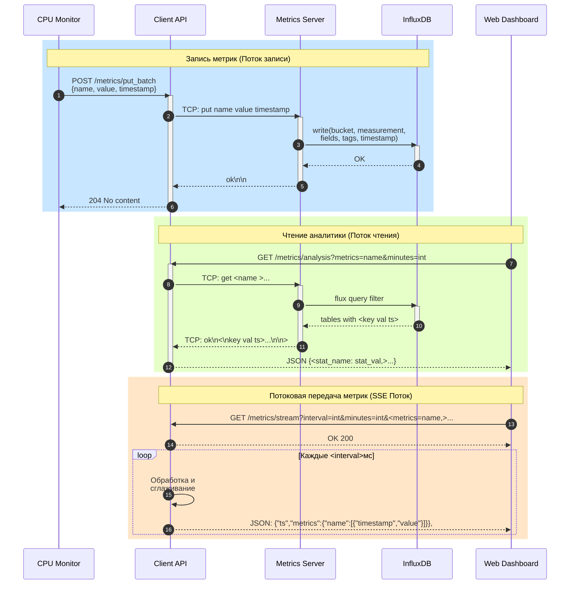

# Metrics Platform

Проект предназначен для сбора, хранения и визуализации системных метрик (например, данных о загрузке CPU). Архитектура построена на микросервисном подходе, сервисы разворачиваются через `docker-compose`.

## Структура проекта

| Компонент | Назначение | Статус |
|------------|-------------|---------|
| **metrics_server** | Принимает метрики от клиентов, пишет в InfluxDB | ✅ готов |
| **metrics_client_api** | HTTP‑обёртка (FastAPI) над socket‑клиентом, мост между другими сервисами и сервером метрик | ✅ готов |
| **cpu_monitor** | Агент, читающий системные показатели с хоста и передающий их клиенту | ✅ готов |
| **influxdb** | Временное хранилище метрик | ✅ готов |
| **marimo_dashboard** | Marimo‑тетрадка для визуализации данных с двумя панелями графиков | ✅ готов |
| **web_dashboard** | Веб‑фронтенд с метриками | ✅ готов |

## Технологии

- **Python 3.14**
- **FastAPI**
- **InfluxDB 2.7**
- **Docker / Docker Compose**
- **Uvicorn** как HTTP‑сервер для API

---

## Запуск в Docker Compose (Production)

### Предварительные требования

- Docker и Docker Compose установлены
- Файл `.env` в корне проекта (см. пример ниже)

### Переменные окружения

Создайте файл `.env` в корне проекта:

```bash
# InfluxDB credentials
INFLUX_USER=admin
INFLUX_PASS=secure_password_here
INFLUX_ORG=myorg
INFLUX_BUCKET=metrics
INFLUX_TOKEN=my_super_secret_token
```

### Сборка и запуск всех сервисов

```bash
# Сборка образов
docker compose build

# Запуск всех сервисов в фоновом режиме
docker compose up -d

# Проверка статуса
docker compose ps

# Просмотр логов
docker compose logs -f
```

### Остановка сервисов

```bash
# Остановить все сервисы
docker compose down

# Остановить и удалить тома (данные InfluxDB будут удалены!)
docker compose down -v
```

### Доступ к сервисам после запуска

| Сервис | URL | Описание |
|--------|-----|----------|
| Web Dashboard | http://localhost:4000 | Веб-интерфейс с SSE потоком |
| Marimo Dashboard | http://localhost:8080 | Интерактивная тетрадка с двумя панелями |
| Metrics Client API | http://localhost:8000/docs | Swagger UI API |
| Metrics Server | localhost:8888 | TCP сервер метрик |
| InfluxDB | http://localhost:8086 | UI InfluxDB |

---

## Запуск в режиме разработки (Debug)

### 1. Использование скрипта infra.sh (рекомендуется)

Для быстрой разработки используйте скрипт `infra.sh`, который запускает все сервисы на хосте:

```bash
# Предварительно установите зависимости для всех сервисов
cd services/metrics_server && pip install -e .
cd ../metrics_client_api && pip install -e .
cd ../cpu_monitor && pip install -e .
cd ../web_dashboard && pip install -e .

# Запустить инфраструктуру
chmod +x infra.sh
./infra.sh
```

Скрипт автоматически активирует виртуальные окружения и запустит:
- Metrics Server
- Metrics Client API (с auto-reload)
- CPU Monitor
- Web Dashboard

**Важно:** InfluxDB необходимо запустить отдельно в Docker:

```bash
docker run -d --name influxdb -p 8086:8086 \
  -e DOCKER_INFLUXDB_INIT_MODE=setup \
  -e DOCKER_INFLUXDB_INIT_USERNAME=admin \
  -e DOCKER_INFLUXDB_INIT_PASSWORD=password \
  -e DOCKER_INFLUXDB_INIT_ORG=myorg \
  -e DOCKER_INFLUXDB_INIT_BUCKET=metrics \
  -e DOCKER_INFLUXDB_INIT_ADMIN_TOKEN=token \
  influxdb:2.7-alpine
```

### 2. Гибридный подход (контейнеры + хост)

Для разработки можно оставить в Docker только базу данных и Marimo dashboard, а остальные сервисы запускать на хосте:

```bash
# Запустить в Docker только InfluxDB и Marimo
docker compose up -d influxdb marimo_dashboard

# Остальные сервисы запустить на хосте вручную
cd services/metrics_server && python -m server.main
cd services/metrics_client_api && uvicorn metrics_client_api.main:app --reload
cd services/cpu_monitor && python -m cpu_monitor.main
cd services/web_dashboard && uvicorn web_dashboard.main:app --reload
```

### 3. Запуск отдельных сервисов в Docker

```bash
# Запустить только API клиент
docker compose up metrics_client_api --build

# Запустить API + сервер метрик
docker compose up metrics_client_api metrics_server --build

# Запустить всё кроме dashboard
docker compose up influxdb metrics_server metrics_client_api cpu_monitor --build
```

### 4. Hot-reload для веб-разработки

Для включения автоперезагрузки при изменении кода раскомментируйте в `docker-compose.yml`:

```yaml
web_dashboard:
  volumes:
    - ./services/web_dashboard/src:/app/src
  command: ["uvicorn", "web_dashboard.main:app", "--host", "0.0.0.0", "--port", "4000", "--reload"]
```

**Важно:** Для CPU Monitor существуют готовые скрипты установки и запуска для разных систем (см. раздел ниже).

---

## Запуск на хосте (без Docker)

### Общие требования

- Python 3.11+
- Установленные зависимости для каждого сервиса

### 1. Metrics Server

```bash
cd services/metrics_server

# Создать виртуальное окружение
python -m venv .venv
source .venv/bin/activate  # Linux/Mac
# или .venv\Scripts\activate  # Windows

# Установить зависимости
pip install -e .

# Запустить сервер
python -m server.main
```

**Переменные окружения:**
```bash
export INFLUX_URL=http://localhost:8086
export INFLUX_USER=admin
export INFLUX_PASS=password
export INFLUX_ORG=myorg
export INFLUX_BUCKET=metrics
export INFLUX_TOKEN=token
```

### 2. Metrics Client API

```bash
cd services/metrics_client_api

# Создать виртуальное окружение
python -m venv .venv
source .venv/bin/activate

# Установить зависимости
pip install -e .

# Запустить в режиме разработки (auto-reload)
uvicorn metrics_client_api.main:app --host 0.0.0.0 --port 8000 --reload

# Или в production режиме
uvicorn metrics_client_api.main:app --host 0.0.0.0 --port 8000 --workers 4
```

**Переменные окружения:**
```bash
export METRICS_SERVER_HOST=localhost
export METRICS_SERVER_PORT=8888
```

### 3. CPU Monitor

#### Быстрый запуск с помощью скриптов

Для CPU Monitor предусмотрены готовые скрипты установки и запуска для различных операционных систем:

**Linux/macOS:**
```bash
cd services/cpu_monitor

# Установка и запуск одним скриптом
chmod +x install_and_run.sh
./install_and_run.sh
```

**Windows:**
```bat
cd services/cpu_monitor

:: Установка и запуск одним скриптом
install_and_run_agent.bat

:: Или по отдельности
install_agent.bat    :: только установка
run_agent.bat        :: только запуск (после установки)
```

#### Ручная установка и запуск

Если вы предпочитаете ручную настройку:

```bash
cd services/cpu_monitor

# Создать виртуальное окружение
python -m venv .venv_cpu_monitor

# Активировать виртуальное окружение
source .venv_cpu_monitor/bin/activate  # Linux/Mac
# или .venv_cpu_monitor\Scripts\activate  # Windows

# Установить зависимости
pip install -e .

# Запустить агент
python -m cpu_monitor.main
# или просто cpu-monitor (если установлен в систему)
```

**Переменные окружения:**
```bash
export METRICS_API_URL=http://localhost:8000
export CPU_SCRAPE_INTERVAL=5
export CPU_COMPRESSOR=none
# или для production с сжатием:
# export CPU_COMPRESSOR="sausage_links"
# export COMPRESSOR_MAX_LEN=10
```

**Примечание:** Скрипт `install_and_run.sh` создаёт собственное виртуальное окружение `.venv_cpu_monitor` и использует его для запуска агента, что позволяет изолировать зависимости CPU Monitor от других сервисов.


### 4. Web Dashboard

```bash
cd services/web_dashboard

# Создать виртуальное окружение
python -m venv .venv
source .venv/bin/activate

# Установить зависимости
pip install -e .

# Запустить в режиме разработки
uvicorn web_dashboard.main:app --host 0.0.0.0 --port 4000 --reload
```

**Переменные окружения:**
```bash
export METRICS_API_BASE=http://localhost:8000
export WEB_DASHBOARD_HOST=0.0.0.0
export WEB_DASHBOARD_PORT=4000
```

### 5. Marimo Dashboard

```bash
cd services/marimo_dashboard

# Создать виртуальное окружение
python -m venv .venv
source .venv/bin/activate

# Установить зависимости
pip install -e .

# Запустить в режиме редактирования (разработка)
marimo edit notebooks/dashboard.py --host 0.0.0.0 --port 8080

# Или запустить в режиме просмотра (production)
marimo run notebooks/dashboard.py --host 0.0.0.0 --port 8080
```

**Переменные окружения:**
```bash
export METRICS_CLIENT_API_HOST=localhost
export METRICS_CLIENT_API_PORT=8000
```

---

## Сценарии использования

### Production сценарий

Все сервисы запускаются в Docker Compose:

```bash
docker compose up -d --build
```

Преимущества:
- Изоляция зависимостей
- Легкое масштабирование
- Воспроизводимость окружения

### Debug сценарий на хосте

Запуск отдельных компонентов на хосте для отладки:

```bash
# Терминал 1: InfluxDB в Docker
docker run -d --name influxdb -p 8086:8086 \
  -e DOCKER_INFLUXDB_INIT_MODE=setup \
  -e DOCKER_INFLUXDB_INIT_USERNAME=admin \
  -e DOCKER_INFLUXDB_INIT_PASSWORD=password \
  -e DOCKER_INFLUXDB_INIT_ORG=myorg \
  -e DOCKER_INFLUXDB_INIT_BUCKET=metrics \
  -e DOCKER_INFLUXDB_INIT_ADMIN_TOKEN=token \
  influxdb:2.7-alpine

# Терминал 2: Metrics Server на хосте
cd services/metrics_server && python -m server.main

# Терминал 3: Metrics Client API на хосте
cd services/metrics_client_api && uvicorn metrics_client_api.main:app --reload

# Терминал 4: CPU Monitor на хосте
cd services/cpu_monitor && python -m cpu_monitor.main
```

### Гибридный сценарий

Часть сервисов в Docker, часть на хосте:

```bash
# Запустить только InfluxDB в Docker
docker compose up -d influxdb

# Остальные сервисы запустить на хосте вручную
```

---

## Проверка работоспособности

### Health Check endpoints

```bash
# Проверка API
curl http://localhost:8000/metrics/names

# Проверка Web Dashboard
curl http://localhost:4000/health

# Проверка Marimo Dashboard
curl http://localhost:8080/

# Проверка InfluxDB
curl http://localhost:8086/health
```

### Тестовая отправка метрик

```python
from metrics_client import Client

c = Client("localhost", 8888)
c.put("test.metric", 42.0)
print(c.get("test.metric"))
```

### Проверка данных через API

```bash
# Получить список всех метрик
curl http://localhost:8000/metrics/names

# Получить данные конкретной метрики
curl "http://localhost:8000/metrics/cpu.usage_percent?minutes=30"

# Получить статистику по метрикам
curl "http://localhost:8000/metrics/analysis?metrics=cpu.usage_percent&minutes=30"
```

---

## Полезные команды

```bash
# Пересборка конкретного сервиса
docker compose build metrics_client_api

# Просмотр логов сервиса
docker compose logs -f cpu_monitor

# Выполнение команды внутри контейнера
docker compose exec metrics_client_api bash

# Очистка кеша Docker
docker system prune -a
```

---

## Разработка новых функций

1. Создайте ветку от `main`
2. Внесите изменения в код сервиса
3. Протестируйте локально (на хосте или в Docker)
4. Обновите README при изменении конфигурации
5. Создайте Pull Request

---

## Troubleshooting

### Проблемы с подключением к InfluxDB

- Убедитесь, что переменные окружения корректны
- Проверьте логи: `docker compose logs influxdb`
- Убедитесь, что сеть `metrics-net` создана

### Сервис не стартует

- Проверьте зависимости: `docker compose ps`
- Посмотрите логи: `docker compose logs <service_name>`
- Убедитесь, что порты не заняты: `netstat -tlnp | grep <port>`

### Проблемы с правами доступа

При запуске на Linux могут потребоваться права для чтения системных метрик:

```bash
sudo docker compose up -d
```

Или добавьте пользователя в группу docker:

```bash
sudo usermod -aG docker $USER
```


